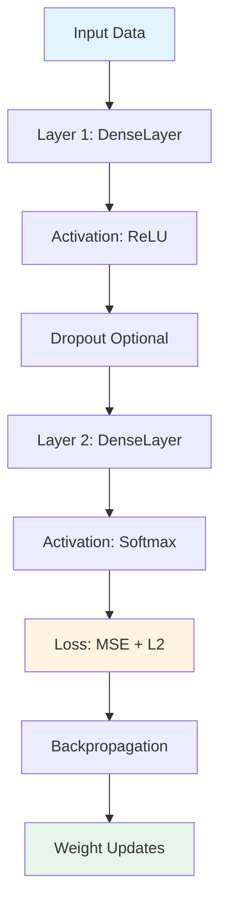

## Overview

This project implements a feed-forward neural network from scratch using NumPy, with a modular architecture designed for transparency, reproducibility, and hardware constraint analysis. The design prioritizes inspectability over raw performance, making it ideal for educational purposes and systems-level experimentation.

<Note>
The architecture is deliberately CPU-oriented and single-threaded to simplify reproducibility and expose system-level trade-offs without distributed training complexity.
</Note>

## Core Components

The architecture follows a layered, composable design that separates concerns across multiple modules:

### Model Layer (`model.py`)

The `NeuralNetworkModel` class is the central orchestrator that manages the forward pass, backpropagation, and training loop.

<CodeGroup>
```python model.py:16-41
class NeuralNetworkModel:
    def __init__(self, layer_sizes, activations, l2_lambda=0.0, dropout_rate=0.0, precision_config=None):
        if len(layer_sizes) < 2:
            raise ValueError("layer_sizes must include input and output sizes")
        if len(activations) != len(layer_sizes) - 1:
            raise ValueError("activations must match number of layers minus one")

        self.config = DEFAULT_CONFIG if precision_config is None else precision_config
        self.train_dtype = np.dtype(self.config.train_dtype)
        self.infer_precision = self.config.infer_precision
        self.int8_clip_value = int(self.config.int8_clip_value)
        self.seed = int(self.config.seed)

        self.layer_sizes = layer_sizes
        self.activations = activations
        self.l2_lambda = l2_lambda
        self.dropout_rate = dropout_rate

        self.rng = np.random.default_rng(self.seed)
        self.layers = [
            DenseLayer(layer_sizes[i], layer_sizes[i + 1], rng=self.rng, dtype=self.train_dtype)
            for i in range(len(layer_sizes) - 1)
        ]
        self.a_values = []
        self.a_raw_values = []
        self.dropout_masks = []
```
</CodeGroup>

**Key responsibilities:**
- Layer instantiation and parameter initialization
- Precision configuration management
- Forward and backward pass coordination
- Training loop with early stopping and validation
- Model persistence (save/load weights)

### Dense Layer (`layers.py`)

`DenseLayer` implements the fundamental fully-connected layer with Xavier uniform initialization:

```python layers.py:4-8
def custom_uniform(n_in, n_out, rng=None, dtype=np.float32):
    limit = np.sqrt(6.0 / (n_in + n_out))
    sampler = np.random if rng is None else rng
    weights = sampler.uniform(-limit, limit, (n_in, n_out))
    return weights.astype(dtype)
```

The layer caches inputs and pre-activation values for efficient gradient computation:

```python layers.py:18-23
def forward(self, x, weights=None, bias=None):
    w = self.weights if weights is None else weights
    b = self.bias if bias is None else bias
    self.input_cache = x
    self.z_cache = x @ w + b
    return self.z_cache
```

### Activation Functions (`activations.py`)

Activations are implemented as standalone functions with corresponding derivative functions:

```python activations.py:15-26
def relu(x):
    return np.maximum(0.0, x)

def relu_derivative_from_pre_activation(z):
    return (z > 0).astype(z.dtype)

def softmax(x):
    shifted = x - np.max(x, axis=1, keepdims=True)
    exp_x = np.exp(shifted)
    return exp_x / (np.sum(exp_x, axis=1, keepdims=True) + EPS)
```

<Warning>
The softmax implementation uses numerical stabilization (subtracting the max) to prevent overflow, which is critical for numerical stability.
</Warning>

### Configuration (`config.py`)

Centralized configuration using dataclasses for type safety and clarity:

```python config.py:6-18
@dataclass
class PrecisionConfig:
    train_dtype: str = "float32"
    infer_precision: str = "float32"  # float32 | float16 | int8
    int8_clip_value: int = 127
    seed: int = 42
    enable_profiling: bool = False
    enable_hardware_simulation: bool = False
    max_memory_mb: float = 512.0
    compute_speed_factor: float = 1.0
    precision_mode: str = "float32"
    batch_size_limit: int = 128
```

## Architecture Flow



## Design Decisions

### NumPy-First Implementation

<Card title="Trade-off" icon="scale-balanced">
  **Advantages:**
  - Transparent tensor operations
  - Easy debugging and inspection
  - No hidden autograd magic
  - CPU-friendly for reproducibility
  
  **Trade-offs:**
  - Lower raw performance than optimized kernels
  - No GPU acceleration
  - Manual gradient implementation
</Card>

### Modular Layer Design

Each layer is self-contained with its own forward and backward methods, making it easy to:
- Add new layer types
- Profile individual layer performance
- Inspect intermediate activations
- Test gradients independently

### Explicit Caching Strategy

The model caches values during forward pass for efficient backpropagation:

```python model.py:93-114
self.a_values = []
self.a_raw_values = []
self.dropout_masks = []

current = x.astype(self.train_dtype)
last_idx = len(self.layers) - 1

for idx, (layer, activation_name) in enumerate(zip(self.layers, self.activations)):
    z = layer.forward(current)
    a_raw = activation_forward(z, activation_name).astype(self.train_dtype)

    if training and self.dropout_rate > 0 and idx < last_idx:
        keep_prob = 1.0 - self.dropout_rate
        mask = (self.rng.random(a_raw.shape) < keep_prob).astype(self.train_dtype) / keep_prob
        current = a_raw * mask
        self.dropout_masks.append(mask)
    else:
        current = a_raw
        self.dropout_masks.append(None)

    self.a_raw_values.append(a_raw)
    self.a_values.append(current)
```

### Parameter Count vs Memory Footprint

For a standard 784-64-10 network:
- Layer 1: 784 × 64 + 64 = 50,240 parameters
- Layer 2: 64 × 10 + 10 = 650 parameters
- **Total: 50,890 parameters**

In float32: 50,890 × 4 bytes = **~198 KB**

<Info>
Activation memory scales with batch size, while parameter memory is constant. See [Hardware Constraints](/concepts/hardware-constraints) for detailed memory analysis.
</Info>

## Student Wrapper (`student.py`)

The `NeuralNetwork` class provides a simplified interface that inherits from `NeuralNetworkModel`:

```python student.py:16-24
class NeuralNetwork(NeuralNetworkModel):
    def __init__(self, layer_sizes, activations, l2_lambda=0.0, dropout_rate=0.0, precision_config=DEFAULT_CONFIG):
        super().__init__(
            layer_sizes,
            activations,
            l2_lambda=l2_lambda,
            dropout_rate=dropout_rate,
            precision_config=precision_config,
        )
```

## Training Pipeline

The `fit` method implements mini-batch SGD with optional early stopping:

<Steps>
  <Step title="Data preparation">
    Convert labels to one-hot encoding and normalize inputs to float32
  </Step>
  <Step title="Epoch loop">
    Shuffle data (optional) and iterate through mini-batches
  </Step>
  <Step title="Batch update">
    Call `backprop` to compute gradients and update weights
  </Step>
  <Step title="Validation">
    Evaluate on validation set and check early stopping criteria
  </Step>
  <Step title="Checkpoint">
    Save best weights if validation loss improves
  </Step>
</Steps>

## Next Steps

<CardGroup cols={2}>
  <Card title="Hardware Constraints" icon="microchip" href="/concepts/hardware-constraints">
    Learn how memory and compute constraints are modeled
  </Card>
  <Card title="Precision Modes" icon="sliders" href="/concepts/precision-modes">
    Understand float32, float16, and int8 precision paths
  </Card>
</CardGroup>