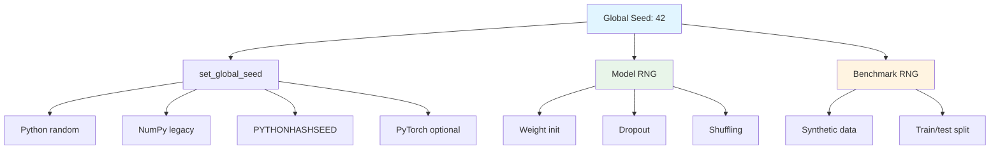

## Overview

Reproducibility is a core design principle of this project. All experiments are designed to produce **identical results** when run with the same configuration, enabling reliable comparisons, debugging, and scientific validation.

<Info>
This implementation prioritizes reproducibility over performance, accepting some overhead to guarantee deterministic behavior.
</Info>

## Reproducibility Module

The `reproducibility.py` module provides utilities for deterministic execution:

```python reproducibility.py:12-33
def set_global_seed(seed: int, deterministic: bool = True) -> None:
    """Set random seeds for Python, NumPy and optionally PyTorch."""
    seed = int(seed)
    os.environ["PYTHONHASHSEED"] = str(seed)
    random.seed(seed)
    np.random.seed(seed)

    try:
        import torch

        torch.manual_seed(seed)
        if torch.cuda.is_available():
            torch.cuda.manual_seed_all(seed)
        if deterministic:
            torch.use_deterministic_algorithms(True)
            if hasattr(torch.backends, "cudnn"):
                torch.backends.cudnn.deterministic = True
                torch.backends.cudnn.benchmark = False
    except Exception:
        # PyTorch is optional in this repository.
        pass
```

### Seeded Components

<Steps>
  <Step title="Python's random module">
    `random.seed(seed)` for standard library random operations
  </Step>
  <Step title="NumPy's legacy RNG">
    `np.random.seed(seed)` for compatibility with old-style random calls
  </Step>
  <Step title="PYTHONHASHSEED">
    Environment variable controlling hash randomization for deterministic dict/set ordering
  </Step>
  <Step title="PyTorch (optional)">
    If available, seeds CPU and GPU RNGs and enables deterministic operations
  </Step>
</Steps>

<Note>
PyTorch seeding is optional since the core implementation only requires NumPy. PyTorch is used for optional comparison features.
</Note>

## Modern NumPy RNG

The model uses NumPy's **new Generator API** for better reproducibility:

```python model.py:34
self.rng = np.random.default_rng(self.seed)
```

This is preferred over legacy `np.random` functions because:

<CardGroup cols={2}>
  <Card title="Advantages" icon="check">
    - Independent RNG instances (no global state)
    - Better statistical properties
    - Deterministic across NumPy versions
    - Thread-safe by design
  </Card>
  <Card title="vs Legacy" icon="xmark">
    - Legacy `np.random` uses global state
    - Can have version-dependent behavior
    - Not thread-safe
    - Harder to reason about in complex code
  </Card>
</CardGroup>

### Seeded Operations

All randomness in the model is seeded:

**Weight initialization:**
```python layers.py:4-8
def custom_uniform(n_in, n_out, rng=None, dtype=np.float32):
    limit = np.sqrt(6.0 / (n_in + n_out))
    sampler = np.random if rng is None else rng
    weights = sampler.uniform(-limit, limit, (n_in, n_out))
    return weights.astype(dtype)
```

**Dropout masks:**
```python model.py:104-107
if training and self.dropout_rate > 0 and idx < last_idx:
    keep_prob = 1.0 - self.dropout_rate
    mask = (self.rng.random(a_raw.shape) < keep_prob).astype(self.train_dtype) / keep_prob
    current = a_raw * mask
```

**Data shuffling:**
```python model.py:191-194
if shuffle:
    indices = self.rng.permutation(n_samples)
    X_epoch = X[indices]
    y_epoch = y_train[indices]
```

## Seed Hierarchy

The project uses a cascading seed strategy:



### Configuration-Level Seeding

```python config.py:11
seed: int = 42
```

The default seed (42) is used throughout unless overridden:

```python
config = PrecisionConfig(seed=123)  # Override default
model = NeuralNetwork(layer_sizes=[784, 64, 10], activations=["relu", "softmax"], precision_config=config)
```

### Benchmark-Level Seeding

```python benchmark.py:99-103
def benchmark_one_setup(layer_sizes, activations, precision_mode, batch_size, n_samples=512, epochs=2, seed=42, enable_profiling=False):
    set_global_seed(seed)
    n_features = layer_sizes[0]
    n_classes = layer_sizes[-1]
    X, y = make_synthetic_data(n_samples=n_samples, n_features=n_features, n_classes=n_classes, seed=seed)
```

Every benchmark run explicitly sets the seed, ensuring reproducible results.

## Deterministic Data Generation

Synthetic datasets are generated deterministically:

```python benchmark.py:31-36
def make_synthetic_data(n_samples, n_features, n_classes, seed=42):
    set_global_seed(seed)
    rng = np.random.default_rng(seed)
    X = rng.normal(size=(n_samples, n_features)).astype(np.float32)
    y = rng.integers(0, n_classes, size=n_samples, dtype=np.int32)
    return X, y
```

<Tip>
Synthetic data enables deterministic CI testing without depending on external datasets.
</Tip>

## Reproducibility Checklist

The project includes a comprehensive checklist (`docs/reproducibility_checklist.md`):

<AccordionGroup>
  <Accordion title="Environment Capture">
    ```markdown
    - [ ] Python version is recorded (`python --version`)
    - [ ] Dependencies come from `requirements.txt` and `requirements-dev.txt`
    - [ ] `python scripts/verify_environment.py` passes
    - [ ] CPU model, memory size, and OS details are recorded
    ```
    
    <Info>
    Run `python scripts/verify_environment.py` to validate your environment matches project requirements.
    </Info>
  </Accordion>

  <Accordion title="Dataset Controls">
    ```markdown
    - [ ] Dataset source and version are recorded
    - [ ] SHA256 hash is archived where applicable
    - [ ] Shape checks pass (`features == 784`, minimum row count)
    - [ ] Label range checks pass (`0..9` for Fashion-MNIST)
    ```
    
    Real datasets can vary across downloads. The project validates:
    - Expected shape (784 features, 10 classes)
    - Label range (0-9)
    - Minimum sample count
    - Optional SHA256 hash verification
  </Accordion>

  <Accordion title="Determinism Controls">
    ```markdown
    - [ ] Global random seed is fixed
    - [ ] Experiment configuration is captured (name or JSON payload)
    - [ ] Precision mode is explicit (`float32`, `float16`, `int8` simulation)
    - [ ] Statistical repeat count is fixed and logged
    ```
    
    <Warning>
    Never compare results from different seeds or configurations without explicitly documenting the change.
    </Warning>
  </Accordion>

  <Accordion title="Execution Artifacts">
    ```markdown
    - [ ] Training logs are saved in `experiments/logs/`
    - [ ] Model checkpoints are saved in `experiments/checkpoints/`
    - [ ] Benchmark outputs are saved in `benchmarks/`
    - [ ] Hardware and scaling outputs are saved in `experiments/scaling/`
    - [ ] Profiling reports are saved in `profiling/`
    ```
    
    All outputs are timestamped and include configuration metadata for traceability.
  </Accordion>

  <Accordion title="Reporting Quality">
    ```markdown
    - [ ] Means and confidence intervals are reported for repeated runs
    - [ ] Hardware assumptions are documented alongside results
    - [ ] Skipped optional dependency paths are explicitly marked
    - [ ] Any failed run includes a root-cause note and rerun status
    ```
  </Accordion>
</AccordionGroup>

## Experiment Configuration

Experiments are defined in `config.py` with explicit parameters:

```python config.py:39-83
EXPERIMENT_CONFIGS = {
    "baseline": {
        "dataset_version": "synthetic-v1",
        "layer_sizes": [784, 64, 10],
        "activations": ["relu", "softmax"],
        "epochs": 2,
        "alpha": 0.1,
        "batch_size": 32,
        "seed": 42,
        "precision": "float32",
        "hardware_constraint_mode": "off",
        "synthetic_mode": True,
        "synthetic_samples": 512,
    },
    "real_fashion_mnist": {
        "dataset_path": FASHION_MNIST_SPEC.train_path,
        "dataset_version": FASHION_MNIST_SPEC.version,
        "layer_sizes": [784, 64, 10],
        "activations": ["relu", "softmax"],
        "epochs": 3,
        "alpha": 0.1,
        "batch_size": 32,
        "seed": 42,
        "precision": "float32",
        "hardware_constraint_mode": "off",
        "synthetic_mode": False,
        "dataset_min_rows": 100,
        "dataset_auto_prepare": True,
        "dataset_sha256": None,
    },
}
```

<Tip>
Define new experiment configurations here instead of passing parameters manually. This ensures reproducibility and creates a named reference.
</Tip>

## Verifying Reproducibility

### Same-Machine Reproducibility

Run the same experiment twice:

```bash
python "Neural Network from Scratch/task/train.py" --experiment baseline
python "Neural Network from Scratch/task/train.py" --experiment baseline
```

Both runs should produce **identical** outputs:
- Same final loss (to floating-point precision)
- Same final accuracy
- Same model weights (checksum)
- Same training history

### Cross-Machine Reproducibility

For results to match across different machines:

<Steps>
  <Step title="Match Python version">
    Use the same Python version (e.g., 3.8.10)
  </Step>
  <Step title="Pin dependencies">
    Install from `requirements.txt` with exact versions
  </Step>
  <Step title="Use same seed">
    Ensure experiment config or CLI uses identical seed
  </Step>
  <Step title="Check CPU features">
    NumPy uses CPU features (SSE, AVX) that can affect results
  </Step>
  <Step title="Validate environment">
    Run `python scripts/verify_environment.py` on both machines
  </Step>
</Steps>

<Warning>
**Floating-point differences:** Even with identical seeds, floating-point operations can vary slightly across:
- Different CPU architectures (x86 vs ARM)
- Different BLAS implementations (OpenBLAS, MKL, Accelerate)
- Different compiler optimizations

Expect differences at the ~1e-6 level, not bit-exact matches.
</Warning>

## Limitations

<AccordionGroup>
  <Accordion title="Floating-point non-associativity">
    Floating-point arithmetic is **not associative**:
    ```python
    (a + b) + c != a + (b + c)  # Can differ!
    ```
    
    This means:
    - Different batch sizes can produce slightly different results
    - Parallel reductions may introduce variance
    - Order of operations matters
    
    The project mitigates this by:
    - Single-threaded execution (no race conditions)
    - Fixed batch sizes per experiment
    - Deterministic data ordering
  </Accordion>

  <Accordion title="Hardware-specific optimizations">
    NumPy links to BLAS libraries (OpenBLAS, Intel MKL, Apple Accelerate) that:
    - Use different algorithms
    - Have different rounding behavior
    - May use CPU-specific instructions
    
    To maximize reproducibility:
    - Document the BLAS library used (`numpy.show_config()`)
    - Consider using a consistent BLAS (e.g., OpenBLAS) across machines
    - Accept small differences (~1e-6) as acceptable variance
  </Accordion>

  <Accordion title="Operating system differences">
    Some sources of variance:
    - **Hash randomization:** Controlled by `PYTHONHASHSEED` (set by `set_global_seed`)
    - **Threading libraries:** Single-threaded execution avoids this
    - **System load:** Can affect timing measurements (not functional results)
    
    The project is designed to be bit-exact for functional results (loss, accuracy) but timing benchmarks will vary.
  </Accordion>

  <Accordion title="Optional dependencies">
    PyTorch comparison features are optional:
    - Results without PyTorch should be reproducible
    - Results with PyTorch require matching PyTorch version
    - ONNX export may vary across ONNX versions
    
    The core NumPy implementation is always reproducible.
  </Accordion>
</AccordionGroup>

## Best Practices

<CardGroup cols={2}>
  <Card title="Always set seed explicitly" icon="dice">
    ```python
    set_global_seed(42)
    model.set_seed(42)
    ```
    Never rely on default random state.
  </Card>

  <Card title="Document environment" icon="file-lines">
    ```bash
    python --version > env.txt
    pip freeze >> env.txt
    python scripts/verify_environment.py
    ```
    Save environment info with results.
  </Card>

  <Card title="Use named configs" icon="tag">
    ```python
    train.py --experiment baseline
    ```
    Reference configs by name, not manual parameters.
  </Card>

  <Card title="Save all artifacts" icon="floppy-disk">
    ```python
    model.save_weights("checkpoint.npz")
    save_hardware_log(results)
    ```
    Persist checkpoints and logs for later analysis.
  </Card>
</CardGroup>

## Statistical Repeats

For benchmarking, multiple runs with the same seed verify reproducibility:

```python
python "Neural Network from Scratch/task/statistical_analysis.py" --repeats 5 --seed 42
```

This runs the benchmark 5 times with seed=42 and computes:
- Mean and standard deviation of metrics
- Confidence intervals
- Variance analysis

<Check>
If standard deviation is non-zero with identical seeds, there's a reproducibility bug!
</Check>

## Debugging Non-Reproducibility

If results don't match:

<Steps>
  <Step title="Check seed">
    Verify the same seed is used:
    ```python
    print(f"Model seed: {model.seed}")
    print(f"RNG state: {model.rng.bit_generator.state}")
    ```
  </Step>
  <Step title="Check dependencies">
    Ensure exact versions:
    ```bash
    pip freeze | grep numpy
    pip freeze | grep torch
    ```
  </Step>
  <Step title="Check data">
    Verify input data is identical:
    ```python
    print(f"Data checksum: {hashlib.sha256(X.tobytes()).hexdigest()}")
    ```
  </Step>
  <Step title="Check precision">
    Verify precision mode:
    ```python
    print(f"Train dtype: {model.train_dtype}")
    print(f"Infer precision: {model.infer_precision}")
    ```
  </Step>
  <Step title="Check environment">
    Run environment verification:
    ```bash
    python scripts/verify_environment.py
    ```
  </Step>
</Steps>

## Reproducibility in CI

The project is designed for reproducible CI testing:

```yaml
# Example GitHub Actions workflow
- name: Run deterministic tests
  run: |
    python scripts/verify_environment.py
    python "Neural Network from Scratch/task/train.py" --experiment baseline
    python "Neural Network from Scratch/task/benchmark.py" --seed 42
```

CI results should match local results exactly (modulo small floating-point differences).

## Next Steps

<CardGroup cols={2}>
  <Card title="Architecture" icon="diagram-project" href="/concepts/architecture">
    Understand how reproducibility is built into the architecture
  </Card>
  <Card title="Hardware Constraints" icon="microchip" href="/concepts/hardware-constraints">
    Learn how constraints affect reproducibility
  </Card>
</CardGroup>